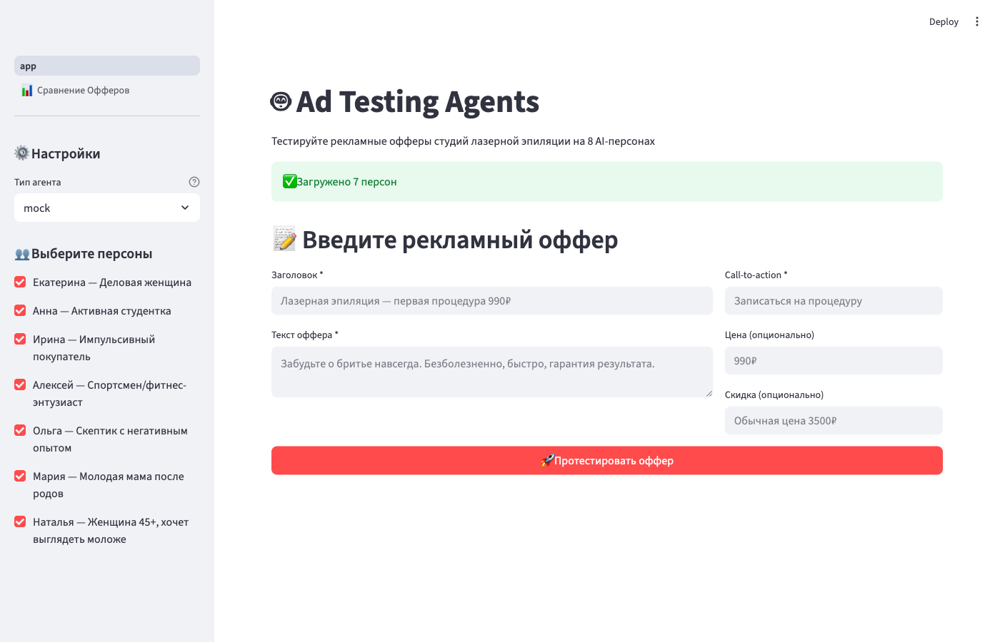
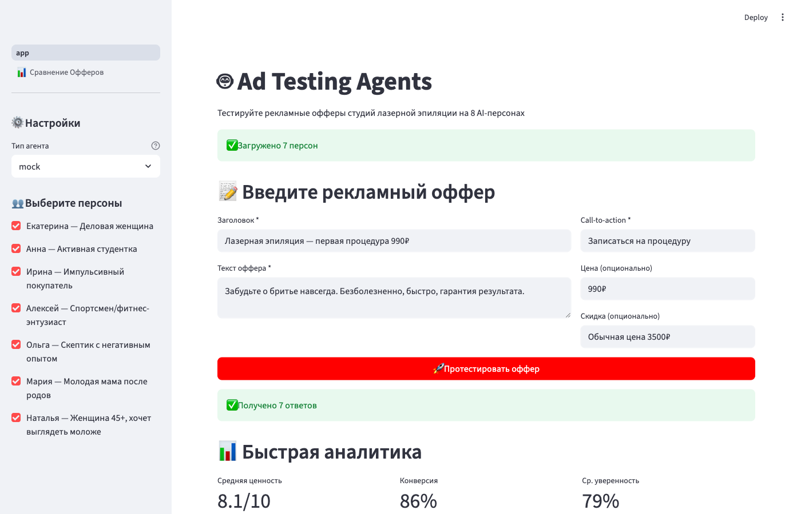
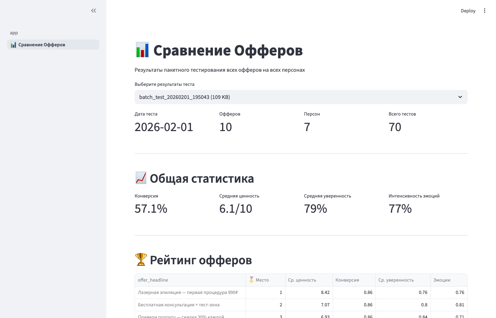

# Ad Testing Agents — SaaS

**Test ad offers on AI personas before spending money on ads.**

Instead of running expensive ad campaigns to find what works — simulate 7 psychologically distinct personas (Big Five model, cognitive biases, life stories) and get conversion rates, perceived value scores, objections, and "what would convince me" in seconds.

## Screenshots

**Main interface — enter your ad offer:**


**Results — 86% conversion, 8.1/10 value, persona-by-persona breakdown:**


**Batch comparison — 10 offers × 7 personas = 70 tests ranked by performance:**


---

## What it does

1. Ты описываешь нишу бизнеса
2. AI генерирует психологически глубоких персон (Big Five, когнитивные искажения, конкретные жизненные истории)
3. AI генерирует рекламные офферы по копирайтерским фреймворкам (PAS, AIDA, BAB, Social Proof, Urgency, Contrarian)
4. Каждая персона оценивает каждый оффер через 5-шаговый анализ (первое впечатление → триггеры → боли/ценности → чеклист критериев → личный опыт)
5. Ты получаешь heatmap, инсайты, рекомендации — какой оффер для какого сегмента работает

## Стек

- **Frontend**: Next.js 16 (App Router, `'use client'`)
- **Backend**: Next.js API Routes + BullMQ workers
- **Database**: PostgreSQL + Prisma ORM
- **Queue**: Redis + BullMQ (конкурентность: 5 воркеров)
- **AI**: OpenRouter API (Google Gemini 3 Flash)
- **Auth**: NextAuth v4 (Credentials + JWT)
- **Tests**: Vitest (94 юнит-теста) + Playwright (E2E)
- **Deploy**: Docker Compose (postgres, redis, next-app, worker)

## Фичи

- Регистрация/логин, демо-проект при первом входе
- CRUD персон и офферов (ручной + AI-генерация)
- Запуск тестов: каждая пара персона×оффер обрабатывается параллельно
- Отчёт в реальном времени: heatmap, winners table, инсайты, стратегия
- Retry для упавших оценок
- Rate limiting (30 req/min API, 3 теста/мин)
- Планы: FREE (5 тестов/мес), PRO (50), AGENCY (безлимит)
- Мобильная адаптация (hamburger-меню, slide-over sidebar)
- Prompt injection protection (`<user_input>` маркеры)

## Качество оценки

Промпты прошли несколько итераций улучшения:

**Генерация персон** (8.3/10): Big Five модель, когнитивные искажения, медиа-привычки, конкретные жизненные истории, anti-patterns

**Генерация офферов** (8.8/10): 6 копирайтерских фреймворков с примерами, правила хорошей рекламы, разные стратегии и психотипы

**System prompt для оценки** (9.2/10): Поведенческий фреймворк по доходу/возрасту, traits→паттерны, decision factors как жёсткие фильтры, 6 anti-patterns

**Evaluation prompt** (9.4/10): 5-шаговый chain-of-thought, калиброванные шкалы, anti-positivity bias (базовая ставка, loss aversion), использование ВСЕХ данных персоны

Пример: generic оффер "Скидка 30% на кофе" получает 3.5/10 (probably_not). Таргетированный оффер, попадающий в боли и триггеры персоны — 9.2/10 (strong_yes).

## Quick Start

См. [QUICKSTART.md](QUICKSTART.md)

## Структура проекта

См. [PROJECT_STRUCTURE.md](PROJECT_STRUCTURE.md)

## Тесты

```bash
cd saas
npx vitest run          # 94 юнит-теста
npx playwright test     # E2E (register → create → generate → test → report)
npx tsc --noEmit        # TypeScript проверка
```

## Утилиты

```bash
# Прогнать одну оценку персона×оффер (из базы)
npx tsx scripts/test-eval.ts

# Прогнать кастомный оффер (без записи в базу)
npx tsx scripts/test-eval-custom.ts
```

## Стоимость

- Gemini 3 Flash через OpenRouter: ~$0.01-0.02 за одну оценку
- Тест 4 персоны × 4 оффера = 16 оценок ≈ $0.15-0.30
- Генерация 4 персон ≈ $0.02, генерация 4 офферов ≈ $0.02

## История

1. **Python-прототип** (`src/`, `dashboard/`) — Streamlit UI + Anthropic API, 8 захардкоженных персон
2. **SaaS** (`saas/`) — полноценное веб-приложение с генерацией персон/офферов, очередью задач, отчётами
